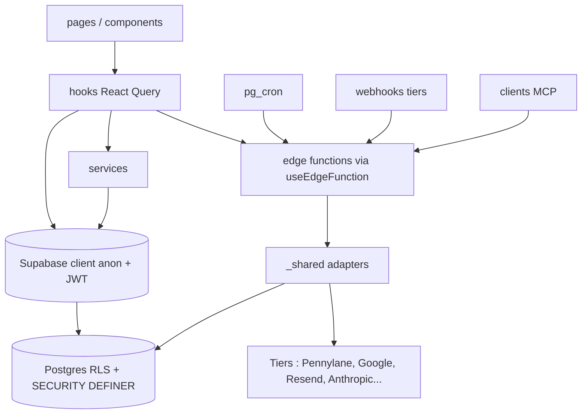
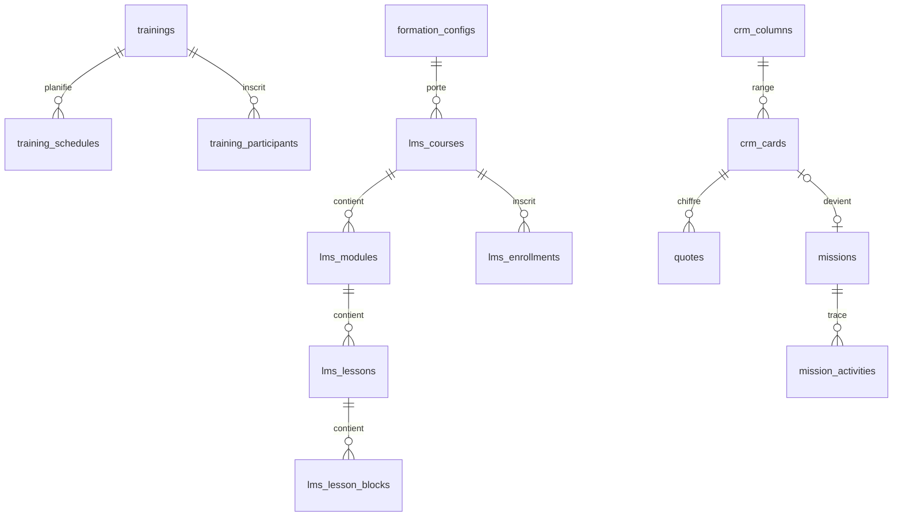

# Architecture Spine : super-tools

Photo ratifiée de l'existant. Les recettes détaillées vivent dans `IMPROVEMENTS.md` et sont citées par numéro `[NNN]` ; cette spine fixe les frontières qu'elles supposent.

## Design Paradigm

**Client épais sur BaaS**, trois couches à responsabilités fixes :

| Couche | Où | Rôle |
| --- | --- | --- |
| UI | `src/pages/`, `src/components/<domaine>/` | Composition, rendu, interactions locales |
| Accès données front | `src/hooks/` (TanStack Query), `src/services/` pour la logique partagée | Seul point de contact du front avec Supabase |
| Frontière d'autorisation | Postgres : RLS + fonctions `SECURITY DEFINER` (`supabase/migrations/`) | Décide qui voit et écrit quoi |
| Backend privilégié | `supabase/functions/<fonction>/` + `supabase/functions/_shared/` | Service role, intégrations tierces, IA, cron, webhooks, MCP |

`_shared/` suit le modèle ports & adapters : un module par service tiers, les fonctions n'appellent jamais le tiers en direct.

Le sens des flèches est la règle de dépendance : aucune flèche inverse, aucun raccourci UI vers Supabase ou vers un tiers.

## Invariants & Rules

### AD-1 : Postgres est la frontière d'autorisation [ADOPTED]

- **Binds:** all
- **Prevents:** un contrôle d'accès fait seulement côté front ou recodé différemment dans chaque fonction.
- **Rule:** Toute table a la RLS active. Une policy décide via les fonctions existantes `is_staff_user()`, `is_admin(uid)`, `has_module_access(uid, module)`, `get_learner_email()`, `current_user_access_level()`, jamais en lisant `auth.users` [044] ni un email en dur [027], jamais en recopiant la logique d'une autre fonction [062]. Une nouvelle règle d'accès devient une fonction SQL, testée sur un vrai Postgres [058].

### AD-2 : Trois populations, trois chemins d'accès [ADOPTED]

- **Binds:** all
- **Prevents:** qu'un apprenant ou un visiteur anonyme atteigne une donnée staff, ou qu'un module invente sa propre notion d'identité.
- **Rule:**
  - **Staff** = `auth.users` + ligne `profiles` (`is_admin`, `user_module_access`). Routes sous `RequireStaff`.
  - **Apprenant** = compte `auth.users` dont l'email figure dans `training_participants` ou `lms_enrollments`. Identifié par son email normalisé (`normalizeEmail()` [059]), jamais par un id staff. Routes sous `RequireLearner`, isolation [030] [031].
  - **Anonyme** = porteur d'un token, uniquement via une RPC `SECURITY DEFINER` `get_*_by_token` qui valide le token [009]. Jamais de policy `anon` sur une table.
  - Le statut vient de `useSession().status` côté front, de `current_user_access_level()` côté base.

### AD-3 : Écritures privilégiées côté serveur uniquement [ADOPTED]

- **Binds:** all
- **Prevents:** une clé service role côté navigateur, un upload qui contourne la RLS.
- **Rule:** La clé service role n'existe que dans les edge functions (`getSupabaseClient()` de `_shared/supabase-client.ts`). Tout upload passe par une edge function [026]. Un bucket nouveau est privé, lu par URL signée [047] [069].

### AD-4 : Chaque edge function déclare son déclencheur et applique sa garde [ADOPTED]

- **Binds:** supabase/functions
- **Prevents:** une fonction sensible ouverte parce que `verify_jwt = false`.
- **Rule:** Toute fonction est déclarée dans `supabase/config.toml` [054] et relève d'une seule classe, avec la garde correspondante [063] :

  | Déclencheur | Garde |
  | --- | --- |
  | Front, utilisateur connecté | `verifyAuth()` (`_shared/supabase-client.ts`), puis `is_admin` / `has_module_access` si besoin |
  | Lien public à token | Token à usage unique vérifié en base |
  | Interne (pg_cron, autre fonction) | `isInternalCall()` / `isInternalOrAuthenticated()` (`_shared/cron-auth.ts`), secret dédié [036] |
  | Webhook tiers | Secret partagé ou signature du fournisseur, vérifié avant tout traitement |
  | MCP | OAuth `mcp_oauth_records` ou clé API |

  Réponses via `createJsonResponse` / `createErrorResponse` et CORS via `_shared/cors.ts` [008], jamais `*`.

### AD-5 : Le front parle à Supabase par les hooks [ADOPTED]

- **Binds:** src
- **Prevents:** une troisième voie d'accès aux données, des caches React Query désynchronisés.
- **Rule:** Aucun `supabase.from/rpc/storage`, `supabase.functions.invoke` ni `fetch` vers Supabase dans `src/pages/` ou `src/components/` pour du code nouveau [014] ; passer par un hook de `src/hooks/`, qui peut déléguer à `src/services/`. Les edge functions s'appellent par `useEdgeFunction()` [020]. Les erreurs remontent par `toastError()` [019] et `reportHandledError()` (Sentry) [037]. Le code existant non conforme se corrige au fil des modifications (ratchets de `check-rules.sh`).

### AD-6 : Un tiers, un adaptateur dans `_shared/` [ADOPTED]

- **Binds:** supabase/functions
- **Prevents:** des copies divergentes d'un même dialogue tiers (token, pagination, erreurs).
- **Rule:** Le dialogue avec un service externe vit dans un seul module `_shared/<tiers>.ts` [052] ; le premier appel à un tiers qui n'en a pas (Stripe, WordPress, AssemblyAI, Brevo, Fireflies, GitHub) crée ce module. Un connecteur paginé expose une fonction de parcours testable [050]. Le schéma d'une API tierce se relève sur les données réelles [061].

### AD-7 : Un appel LLM passe par `aiChat()` [ADOPTED]

- **Binds:** supabase/functions
- **Prevents:** un modèle codé en dur, un coût IA non tracé.
- **Rule:** Les appels LLM passent par `aiChat()` (`_shared/ai.ts`) ; les ids de modèle Claude ne vivent que dans `_shared/claude-models.ts`. Tout appel à une API payante écrit un `api_usage_events` via `_shared/api-usage.ts` [045], idempotent par unité facturée [049].

### AD-8 : Le schéma n'évolue que par migration rejouable [ADOPTED]

- **Binds:** supabase/migrations
- **Prevents:** une table créée à la main en base, un historique qui ne rejoue plus, une migration qui casse l'app en ligne.
- **Rule:** Tout changement de schéma, de policy ou de job cron est un fichier de `supabase/migrations/`, rejouable sur base vierge [042] (vérifié par le workflow `RLS tests`). Une migration qui suppose un front pas encore publié va dans `supabase/migrations-apres-front/`. Pousser sur GitHub n'applique rien : l'application en base est un geste explicite. `src/integrations/supabase/types.ts` est généré, jamais édité à la main. Une migration sur `app_settings` conditionne son `UPDATE` à la valeur attendue [046].

### AD-9 : Toute donnée nouvelle entre dans le cycle de vie [ADOPTED]

- **Binds:** supabase/migrations, supabase/functions/scheduled-backup
- **Prevents:** une table ou un bucket oublié par la sauvegarde, une donnée identifiante visible en démo.
- **Rule:** Toute nouvelle table ou bucket est ajouté aux listes de `scheduled-backup` / `backup-export` ou à `scripts/backup-*-exclusions.txt` [038]. Toute donnée identifiante affichée par un écran interne passe par les masques de `src/lib/demoMask.ts` sous `useDemoMode()` [065] [068].

### AD-10 : Un invariant n'existe que s'il est vérifié par une machine [ADOPTED]

- **Binds:** all
- **Prevents:** une règle écrite que personne n'applique (Lovable ne lit pas les consignes).
- **Rule:** Chaque règle de `IMPROVEMENTS.md` a son check dans `scripts/check-rules.sh` [034], joué en CI et avant chaque commit. Une dette existante se gèle par ratchet (compteur qui ne peut que baisser), pas par exception.

## Consistency Conventions

| Concern | Convention |
| --- | --- |
| Langue | Routes, UI, docs et commits en français ; identifiants de code et tables en anglais `snake_case` |
| Edge functions | Un dossier `kebab-case` par fonction ; classes de nom `process-*` / `sync-*` (interne), `*-webhook`, `upload-*`, `submit-*` / `verify-*` (lien public) |
| Emails | `normalizeEmail()` à la frontière, jamais `lower()` à la lecture [059] |
| Dates | `todayAsISO()` pour la date du jour [023] (`src/lib/dateFormatters.ts`, `_shared/date-utils.ts`) |
| Fichiers | `resolveContentType()`, jamais `file.type` [004] ; table MIME en deux exemplaires contrôlés (front / edge) [052] |
| React Query | `refetchOnWindowFocus: false` [006], erreurs globales vers Sentry (`queryClient`, `src/App.tsx`) |
| UI transverse | `ModuleLayout` + `PageHeader` [015], `<Spinner />` [017], `useConfirm()` [021], `useAutoSaveForm` / `useEntityAutoSave` [001] [024] |
| Configuration | Réglages métier dans `app_settings`, clés d'API tierces lues via `_shared/api-keys.ts` |

## Stack

| Name | Version |
| --- | --- |
| React | 18.3.1 |
| TypeScript | 5.8.3 |
| Vite | 5.4.21 |
| TanStack Query | 5.90.20 |
| React Router | 6.30.4 |
| Tailwind CSS | 3.4.17 |
| supabase-js | 2.110.0 |
| Vitest | 4.0.18 |
| Playwright | 1.58.2 |
| Node (CI) | 20 |

## Structural Seed

Un seul environnement : pas de staging, la production est la seule base.

## Deferred

- **Centraliser les query keys React Query** : 388 clés littérales ad hoc aujourd'hui ; à décider quand deux modules partageront un cache.
- **Généraliser `src/services/`** : les hooks appellent Supabase en direct (145 contre 28) ; AD-5 n'exige pas de service, à trancher lors d'un chantier de refonte.
- **Ranger hooks, services et lib par domaine** : seul `components/` l'est ; à faire avec une refonte, pas au fil de l'eau.
- **Environnement de staging** : absent ; à décider si le volume de migrations risquées augmente.
- **Déploiement des edge functions et des migrations en CI** : aucun aujourd'hui ; hors périmètre tant que Lovable publie.

## Open Questions

- **Buckets publics** : 21 buckets sur 25 sont publics, contre AD-3 / [047]. Migrer lesquels, dans quel ordre ?
- **`has_module_access()`** code en dur un email (M20260202130645:26-41), contre [027].
- **`scheduled-backup`** : `verify_jwt = false` sans garde appelant trouvée, contre AD-4.
- **Doc contradictoire** : `docs/AUDIT_AVANT_PUSH.md:4,12` affirme qu'un push applique les migrations, le README de `migrations-apres-front/` (18/09/2026) affirme l'inverse. AD-8 suit le README, plus récent et vérifié en base.
- **`get_learner_email()`** lit encore l'en-tête `x-learner-email` tant que `lot6c` (migrations-apres-front) n'est pas joué.
