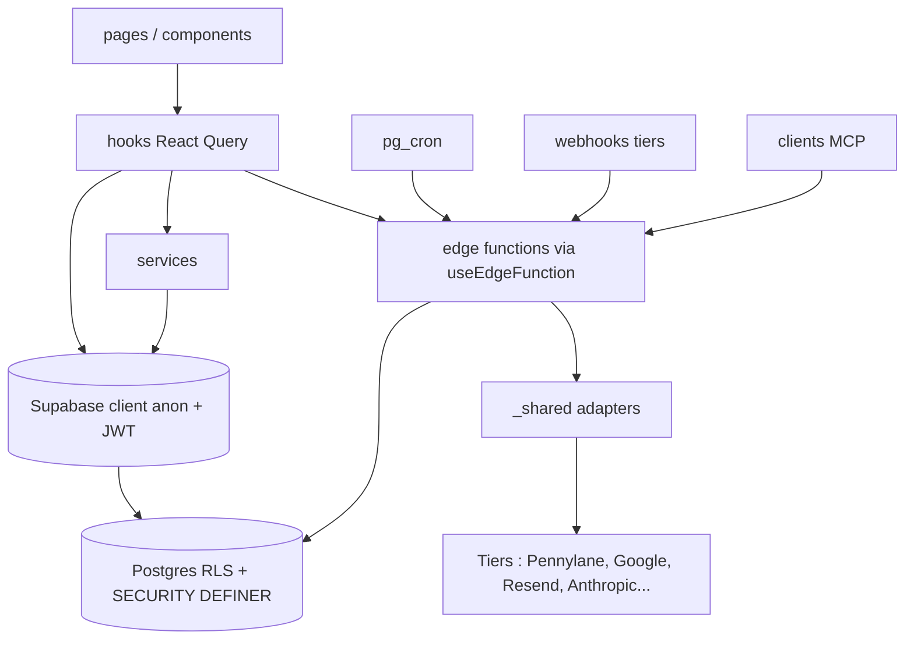
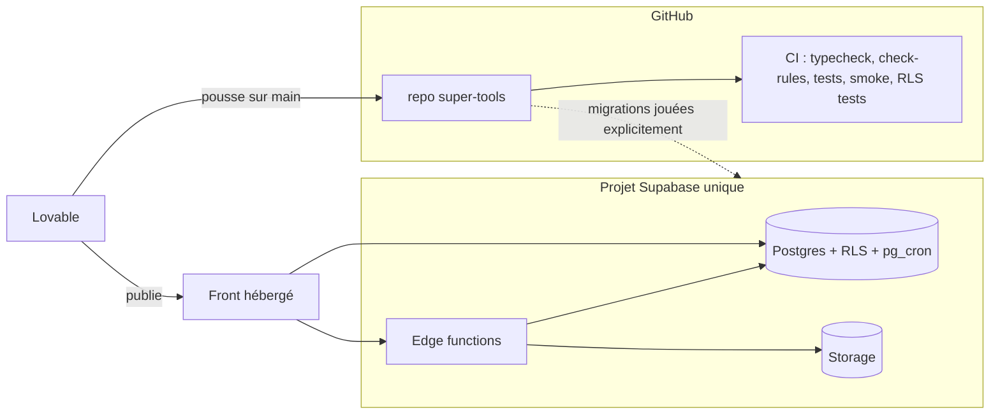
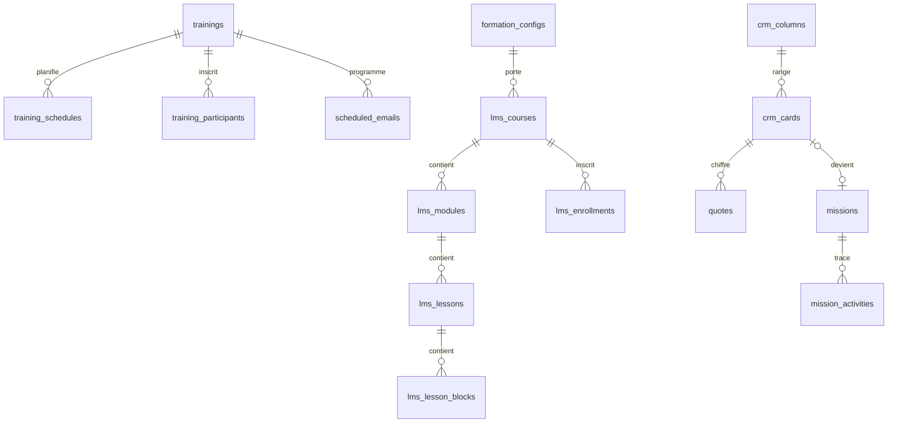

# Architecture Spine : super-tools

Contrat de cohérence pour tout code nouveau ou modifié. Il ratifie l'existant quand l'existant tient, et fixe la cible quand il diverge : dans ce cas la dette actuelle est chiffrée et gelée, jamais étendue. Les recettes vivent dans `IMPROVEMENTS.md`, citées par numéro `[NNN]`.

`[ADOPTED]` = déjà la règle du code. `[TARGET]` = règle pour le code nouveau, l'existant diverge encore. `[ASSUMPTION]` = décision proposée, à confirmer.

## Design Paradigm

**Client épais sur BaaS**, quatre couches à responsabilités fixes :

| Couche | Où | Rôle |
| --- | --- | --- |
| UI | `src/pages/`, `src/components/<domaine>/` | Composition, rendu, interactions locales |
| Accès données front | `src/hooks/` (TanStack Query), `src/services/` pour la logique partagée | Seul point de contact du front avec Supabase |
| Frontière d'autorisation | Postgres : RLS + fonctions `SECURITY DEFINER` (`supabase/migrations/`) | Décide qui voit et écrit quoi |
| Backend privilégié | `supabase/functions/<fonction>/` + `supabase/functions/_shared/` | Service role, effets de bord, intégrations, IA, cron, webhooks, MCP |

`_shared/` suit le modèle ports & adapters : un module par service tiers.

Le sens des flèches est la règle de dépendance : pas de flèche inverse, pas de raccourci UI vers Supabase ni fonction vers un tiers hors `_shared/`.

## Invariants & Rules

### AD-1 : Postgres est la frontière d'autorisation [ADOPTED]

- **Binds:** all
- **Prevents:** un contrôle d'accès fait seulement côté front ou recodé différemment d'une fonction à l'autre.
- **Rule:** Toute table a la RLS active (252 aujourd'hui). Une policy décide par le catalogue existant : `is_staff_user()`, `is_admin(uid)`, `has_module_access(uid, module)`, `has_crm_access()`, `is_service_role()`, `is_known_learner(email)`, `get_learner_email()`, `current_user_access_level()`. Jamais `auth.users` [044], jamais d'email en dur [027], jamais de recopie de cette logique [062]. Une règle d'accès nouvelle devient une fonction SQL du catalogue, testée sur un vrai Postgres [058].

### AD-2 : Trois populations, trois chemins d'accès [ADOPTED]

- **Binds:** all
- **Prevents:** qu'un apprenant ou un anonyme atteigne une donnée staff, qu'un module invente sa notion d'identité.
- **Rule:**
  - **Staff** = `is_staff_user()` : `profiles.is_admin` ou au moins une ligne `user_module_access`. Routes sous `RequireStaff`.
  - **Apprenant** = compte `auth.users` dont l'email figure dans `training_participants` ou `lms_enrollments`, identifié par son email normalisé [059] (`lower(trim())` en SQL). Routes sous `RequireLearner`, isolation [030] [031].
  - **Anonyme** = porteur d'un token. Code nouveau : uniquement via une RPC `SECURITY DEFINER` `get_*_by_token`. Une policy `anon` sur table n'est admise que si elle valide un token [009].
  - Le statut se lit dans `useSession().status` (front) et `current_user_access_level()` (base), jamais recalculé ailleurs.

### AD-3 : Écritures privilégiées côté serveur uniquement [ADOPTED]

- **Binds:** all
- **Prevents:** une clé service role côté navigateur, un upload qui contourne la RLS.
- **Rule:** La clé service role n'existe que dans les edge functions, obtenue par `getSupabaseClient()` (`_shared/supabase-client.ts`) pour le code nouveau. Tout upload passe par une edge function [026]. Un bucket nouveau est privé, lu par URL signée [047] [069].

### AD-4 : Chaque edge function déclare son déclencheur et applique sa garde [TARGET]

- **Binds:** supabase/functions
- **Prevents:** une fonction sensible ouverte parce que `verify_jwt = false` (228 sur 243).
- **Rule:** Toute fonction est déclarée dans `supabase/config.toml` [054] et relève d'une seule classe, avec sa garde [063] :

  | Déclencheur | Garde |
  | --- | --- |
  | Front, utilisateur connecté | `verifyAuth()` (`_shared/supabase-client.ts`), puis `is_admin` / `has_module_access` si besoin |
  | Lien public à token | Token à usage unique vérifié en base |
  | Interne (pg_cron, autre fonction) | `isInternalCall()` / `isInternalOrAuthenticated()` (`_shared/cron-auth.ts`), secret dédié [036] |
  | Webhook tiers | Secret partagé ou signature du fournisseur, vérifié avant tout traitement |
  | MCP | OAuth `mcp_oauth_records` ou clé API |

  Réponses via `createJsonResponse` / `createErrorResponse`, CORS via `_shared/cors.ts` [008], jamais `*`. [063] n'a pas encore de check machine (`MANUAL_RULES` de `check-rules.sh`) : voir AD-10.

### AD-5 : Le front parle à Supabase par les hooks [TARGET]

- **Binds:** src
- **Prevents:** une troisième voie d'accès aux données, des caches React Query désynchronisés.
- **Rule:** Aucun `supabase.from/rpc/storage/functions.invoke` ni `fetch` vers Supabase dans `src/pages/` ou `src/components/` pour du code nouveau [014] : passer par un hook de `src/hooks/`, qui peut déléguer à `src/services/`. Les edge functions s'appellent par `useEdgeFunction()` [020]. Les erreurs remontent par `toastError()` [019] et `reportHandledError()` [037]. Dette actuelle : ~150 fichiers UI accèdent en direct, gelés par la liste blanche de [014b], qui ne voit pas un ajout dans un fichier déjà listé.

### AD-6 : Un tiers, un adaptateur dans `_shared/` [TARGET]

- **Binds:** supabase/functions
- **Prevents:** des copies divergentes d'un même dialogue tiers (token, pagination, erreurs).
- **Rule:** Un appel nouveau à un service externe passe par `_shared/<tiers>.ts` [052] ; le premier appel à un tiers qui n'en a pas le crée. Connecteur paginé = fonction de parcours testable [050] ; schéma relevé sur les données réelles [061]. Dette actuelle hors `_shared/` : Google (14 fonctions), OpenAI (5), WordPress, Fireflies, AssemblyAI (3 chacun), Brevo, GitHub (2 chacun) ; seuls Pennylane, le refresh OAuth Google et les tables MIME sont contrôlés (052a/b/c).

### AD-7 : Un appel LLM passe par `aiChat()` [TARGET]

- **Binds:** supabase/functions
- **Prevents:** un modèle codé en dur, un coût IA non tracé.
- **Rule:** Un appel LLM nouveau passe par `aiChat()` (`_shared/ai.ts`). Les ids de modèle Claude ne vivent que dans `_shared/claude-models.ts` et sa copie contrôlée `src/lib/claude-models.ts` [057]. Tout appel payant écrit un `api_usage_events` via `_shared/api-usage.ts` [045], idempotent par unité facturée [049]. Dette actuelle : 15 fonctions appellent `api.anthropic.com` en direct.

### AD-8 : Le schéma n'évolue que par migration rejouable [ADOPTED]

- **Binds:** supabase/migrations
- **Prevents:** une table, un bucket ou un job créé à la main en base, un historique qui ne rejoue plus, une migration qui casse l'app en ligne.
- **Rule:** Tout changement de schéma, policy, bucket ou job `pg_cron` est un fichier de `supabase/migrations/`, rejouable sur base vierge [042] (workflow `RLS tests`). Une migration qui suppose un front pas encore publié va dans `supabase/migrations-apres-front/`. Pousser sur GitHub n'applique rien : l'application en base est un geste explicite. `src/integrations/supabase/types.ts` est généré, jamais édité. Une migration sur `app_settings` conditionne son `UPDATE` à la valeur attendue [046].

### AD-9 : Toute donnée nouvelle entre dans le cycle de vie [ADOPTED]

- **Binds:** supabase/migrations, supabase/functions/scheduled-backup
- **Prevents:** une table ou un bucket oublié par la sauvegarde, une donnée identifiante visible en démo.
- **Rule:** Toute nouvelle table ou bucket est ajouté aux listes de `scheduled-backup` et `backup-export`, ou à `scripts/backup-exclusions.txt` / `scripts/backup-bucket-exclusions.txt` [038]. Toute donnée identifiante d'un écran interne passe par `src/lib/demoMask.ts` sous `useDemoMode()` [065] [068].

### AD-10 : Un invariant n'existe que s'il est vérifié par une machine [TARGET]

- **Binds:** all
- **Prevents:** une règle écrite que personne n'applique (Lovable ne lit pas les consignes et pousse sur `main`).
- **Rule:** Toute règle nouvelle de `IMPROVEMENTS.md` arrive avec son check dans `scripts/check-rules.sh` [034], joué en CI et par le hook Claude Code avant commit (il n'y a pas de hook git). Une dette se gèle par ratchet, pas par exception. Sans check aujourd'hui : [002] [013] [022] [024] [029] [032] [033] [063]. Une AD `[TARGET]` n'est tenue que lorsqu'un ratchet la gèle.

### AD-11 : Une entité à effets de bord a un seul propriétaire [ASSUMPTION]

- **Binds:** training_participants, scheduled_emails, crm_cards.estimated_value, colonnes learner_email
- **Prevents:** plusieurs chemins de création qui déclenchent des effets différents (emails, compte apprenant, inscription LMS).
- **Rule:** Une entité dont la création ou le changement d'état déclenche des effets de bord a un propriétaire unique, edge function ou fonction SQL `SECURITY DEFINER`, déclaré ci-dessous. Tous les points d'entrée (écran, import en masse, webhook, lien public, MCP) l'appellent ; aucun n'écrit la table en direct.

  | Entité / action | Propriétaire |
  | --- | --- |
  | Ajout d'un participant | `add-training-participant` |
  | Changement d'email d'un apprenant | `change_learner_email()` |
  | Valeur estimée d'une opportunité | `recompute_opportunity_estimated_value()` |
  | Programmation d'un email de formation | `scheduled_emails`, écrit par son propriétaire métier, voir AD-12 |

  Dette actuelle : `src/services/bulkParticipants.ts` et `submit-devis-signature` insèrent des participants en direct ; le formulaire d'édition met à jour l'email sans `change_learner_email()` ; `estimated_value` est aussi écrite par les hooks CRM et l'outil MCP.

### AD-12 : Un type d'email, un nom, une file [ASSUMPTION]

- **Binds:** supabase/functions (envois), scheduled_emails, sent_emails_log, activity_logs
- **Prevents:** trois vocabulaires pour le même envoi, des rappels recréés après annulation, des doublons.
- **Rule:** Un type d'email a un identifiant unique, le même dans `scheduled_emails.email_type`, `sent_emails_log.email_type` et `activity_logs` ; `sendEmail()` reçoit toujours `_emailType`. `scheduled_emails` est la seule file d'envoi programmé ; une annulation passe `status` à `cancelled`, jamais `DELETE`, et tout `reconcile-*` / `monitor_*` la respecte. L'état « envoyé » se lit dans `sent_emails_log`. Dette actuelle : `convention` / `convention_email_sent` / `convention_email` ; 13 appels sans `_emailType` ; `crm_scheduled_emails` sans consommateur.

### AD-13 : Montants et colonnes dérivées [ASSUMPTION]

- **Binds:** finance, crm, devis
- **Prevents:** un chiffre qui mélange HT et TTC, une colonne dérivée écrasée à la main.
- **Rule:** Un montant porte son unité dans son nom (`_ht`, `_ttc`, `_cents`). Une colonne dérivée a une seule fonction SQL écrivain. Un état métier vit dans une table typée ; le SQL ne le lit jamais dans le JSON `activity_logs.details`.

### AD-14 : Une règle métier à effet de bord s'exécute côté serveur [ASSUMPTION]

- **Binds:** src/lib, supabase/functions/_shared
- **Prevents:** deux copies d'une même règle qui divergent (front et edge).
- **Rule:** La décision d'un effet de bord (quand envoyer, quel statut, quel calcul de jours) est prise côté serveur. Une copie front inévitable porte un commentaire `// twin: <chemin>` et partage des cas de test joués des deux côtés [057]. Paires connues : `src/lib/emailScheduling.ts` / `add-training-participant` (déjà divergentes), `src/lib/workingDays.ts` / `_shared/working-days.ts`, `src/lib/stateMachine.ts` / `_shared/state-machine.ts`.

### AD-15 : Enveloppe d'exploitation [ADOPTED]

- **Binds:** all
- **Prevents:** une fonction qui marche en local et pas en production, un secret introuvable, une erreur muette.
- **Rule:** Un seul environnement, la production (projet Supabase `yewffntzgrdgztrwtava`) : tout changement risqué passe par `migrations-apres-front/` ou un feature flag dans `app_settings`, jamais par un staging supposé. Secrets d'infrastructure en variables d'environnement Supabase (`Deno.env.get`) ; clés d'API métier modifiables par l'admin dans `app_settings` via `_shared/api-keys.ts`. Erreurs vers Sentry : `reportHandledError()` côté front, `reportEdgeError()` (`_shared/sentry.ts`) côté edge ; détail dans `docs/observabilite.md`.

## Consistency Conventions

| Concern | Convention |
| --- | --- |
| Langue | Routes, UI, docs et commits en français ; identifiants de code et tables en anglais `snake_case` |
| Edge functions | Un dossier `kebab-case` par fonction ; classes de nom `process-*` / `*-sync` (interne), `*-webhook`, `upload-*`, `submit-*` / `verify-*` (lien public) |
| Emails | `normalizeEmail()` à la frontière, jamais `lower()` à la lecture [059] |
| Dates | `todayAsISO()` pour la date du jour [023] (`src/lib/dateFormatters.ts`, `_shared/date-utils.ts`) |
| Fichiers | `resolveContentType()`, jamais `file.type` [004] ; table MIME en deux exemplaires contrôlés [052] |
| React Query | `refetchOnWindowFocus: false` [006], erreurs globales vers Sentry (`queryClient`, `src/App.tsx`) |
| UI transverse | `ModuleLayout` + `PageHeader` [015], `<Spinner />` [017], `useConfirm()` [021], `useAutoSaveForm` / `useEntityAutoSave` [001] [024] |

## Stack

Versions résolues par `package-lock.json` au 2026-09-24.

| Name | Version |
| --- | --- |
| React | 18.3.1 |
| TypeScript | 5.8.3 |
| Vite | 5.4.21 |
| TanStack Query | 5.90.20 |
| React Router | 6.30.4 |
| Tailwind CSS | 3.4.17 |
| supabase-js (front) | 2.110.0 |
| Vitest | 4.1.8 |
| Playwright | 1.58.2 |
| Node (CI) | 20 |

## Structural Seed

## Deferred

- **Centraliser les query keys React Query** : clés littérales ad hoc aujourd'hui ; à décider quand deux modules partageront un cache.
- **Généraliser `src/services/`** : AD-5 n'exige pas de service ; à trancher lors d'une refonte.
- **Ranger hooks, services et lib par domaine** : seul `components/` l'est ; à faire avec une refonte, pas au fil de l'eau.
- **Environnement de staging** : absent ; à décider si le volume de migrations risquées augmente.
- **Déploiement des edge functions et des migrations en CI** : aucun ; hors périmètre tant que Lovable publie.
- **Ratchets des AD `[TARGET]`** : appels tiers et LLM hors `_shared/`, gardes [063], accès directs UI ; à ajouter à `check-rules.sh` via `/learn`.
- **Ajout d'un module** (enum `app_module`, route, registre de l'agent [041]) : procédure à écrire au prochain module.

## Open Questions

- **Buckets publics** : 22 sur 27 créés par migration sont publics, contre AD-3 / [047] ; `game-restock-files` est utilisé mais créé hors migration (AD-8). Lesquels migrer, dans quel ordre ?
- **Page mission publique** : `/mission-info/:missionId` et `zip-mission-deliverables` exposent documents et livrables à quiconque connaît l'UUID de la mission (`get_mission_*_public` accordées à `anon`). Garder ce modèle de lien secret, ou passer à un token dédié et révocable ?
- **Policies `anon` restantes** (dont `mission_survey_*` en `WITH CHECK (true)`, `training_supports`) : valident-elles un token (AD-2 / [009]) ?
- **CORS** : `_shared/cors.ts:8` retombe sur `*` si `APP_ORIGIN` n'est pas défini.
- **`has_module_access()`** code en dur un email (M20260202130645:26-41), contre [027].
- **Staff côté front** : `RequireStaff` et `useLearnerIdentity` considèrent staff tout compte avec une ligne `profiles`, `is_staff_user()` exige admin ou un accès module.
- **Convocation** : `add-training-participant` envoie la convocation tout de suite dès J-2, le front (`getEmailMode`) la programme au-delà de J-7 ; la branche J-7 de la fonction est inatteignable. Quel comportement est voulu ?
- **Jobs hors dépôt** : `daily-scheduled-backup` et le job de `monitor_missing_evaluation_reminders()` n'ont pas de `cron.schedule` dans les migrations (AD-8).
- **supabase-js côté edge** : trois versions importées depuis esm.sh, dont `@2` non épinglée.
- **Doc contradictoire** : `docs/AUDIT_AVANT_PUSH.md:4,12` affirme qu'un push applique les migrations ; le README de `migrations-apres-front/` (18/09/2026, vérifié en base) affirme l'inverse. AD-8 suit le README.
- **`get_learner_email()`** lit encore l'en-tête `x-learner-email` tant que `lot6c` n'est pas joué.
